# Execution Plan

## Detailed Analysis Summary

### Change Impact Assessment
- **User-facing changes**: Yes — entire application is new user-facing functionality
- **Structural changes**: Yes — new system architecture from scratch
- **Data model changes**: Yes — new data models for meals, nutrition, ingredients, recipes, users
- **API changes**: Yes — new REST API endpoints for all features
- **NFR impact**: Yes — performance (AI response times), scalability (serverless), offline sync

### Risk Assessment
- **Risk Level**: Medium (new project, no production impact, but complex AI integration)
- **Rollback Complexity**: Easy (greenfield, no existing system to break)
- **Testing Complexity**: Moderate (AI responses need mocking, offline sync needs testing)

## Workflow Visualization

```mermaid
flowchart TD
    Start(["User Request"])
    
    subgraph INCEPTION["🔵 INCEPTION PHASE"]
        WD["Workspace Detection<br/><b>COMPLETED</b>"]
        RA["Requirements Analysis<br/><b>COMPLETED</b>"]
        US["User Stories<br/><b>COMPLETED</b>"]
        WP["Workflow Planning<br/><b>COMPLETED</b>"]
        AD["Application Design<br/><b>EXECUTE</b>"]
        UG["Units Generation<br/><b>EXECUTE</b>"]
    end
    
    subgraph CONSTRUCTION["🟢 CONSTRUCTION PHASE"]
        FD["Functional Design<br/>(per-unit)<br/><b>EXECUTE</b>"]
        NFRA["NFR Requirements<br/>(per-unit)<br/><b>EXECUTE</b>"]
        NFRD["NFR Design<br/>(per-unit)<br/><b>EXECUTE</b>"]
        ID["Infrastructure Design<br/>(per-unit)<br/><b>EXECUTE</b>"]
        CG["Code Generation<br/>(per-unit)<br/><b>EXECUTE</b>"]
        BT["Build and Test<br/><b>EXECUTE</b>"]
    end
    
    Start --> WD
    WD --> RA
    RA --> US
    US --> WP
    WP --> AD
    AD --> UG
    UG --> FD
    FD --> NFRA
    NFRA --> NFRD
    NFRD --> ID
    ID --> CG
    CG -.->|Next Unit| FD
    CG --> BT
    BT --> End(["Complete"])
    
    style WD fill:#4CAF50,stroke:#1B5E20,stroke-width:3px,color:#fff
    style RA fill:#4CAF50,stroke:#1B5E20,stroke-width:3px,color:#fff
    style US fill:#4CAF50,stroke:#1B5E20,stroke-width:3px,color:#fff
    style WP fill:#4CAF50,stroke:#1B5E20,stroke-width:3px,color:#fff
    style AD fill:#FFA726,stroke:#E65100,stroke-width:3px,stroke-dasharray: 5 5,color:#000
    style UG fill:#FFA726,stroke:#E65100,stroke-width:3px,stroke-dasharray: 5 5,color:#000
    style FD fill:#FFA726,stroke:#E65100,stroke-width:3px,stroke-dasharray: 5 5,color:#000
    style NFRA fill:#FFA726,stroke:#E65100,stroke-width:3px,stroke-dasharray: 5 5,color:#000
    style NFRD fill:#FFA726,stroke:#E65100,stroke-width:3px,stroke-dasharray: 5 5,color:#000
    style ID fill:#FFA726,stroke:#E65100,stroke-width:3px,stroke-dasharray: 5 5,color:#000
    style CG fill:#4CAF50,stroke:#1B5E20,stroke-width:3px,color:#fff
    style BT fill:#4CAF50,stroke:#1B5E20,stroke-width:3px,color:#fff
    style INCEPTION fill:#BBDEFB,stroke:#1565C0,stroke-width:3px,color:#000
    style CONSTRUCTION fill:#C8E6C9,stroke:#2E7D32,stroke-width:3px,color:#000
    style Start fill:#CE93D8,stroke:#6A1B9A,stroke-width:3px,color:#000
    style End fill:#CE93D8,stroke:#6A1B9A,stroke-width:3px,color:#000
    
    linkStyle default stroke:#333,stroke-width:2px
```



### Text Alternative
```
Phase 1: INCEPTION
- Workspace Detection (COMPLETED)
- Requirements Analysis (COMPLETED)
- User Stories (COMPLETED)
- Workflow Planning (COMPLETED)
- Application Design (EXECUTE)
- Units Generation (EXECUTE)

Phase 2: CONSTRUCTION (per-unit loop)
- Functional Design (EXECUTE, per-unit)
- NFR Requirements (EXECUTE, per-unit)
- NFR Design (EXECUTE, per-unit)
- Infrastructure Design (EXECUTE, per-unit)
- Code Generation (EXECUTE, per-unit)
- Build and Test (EXECUTE, after all units)
```

## Phases to Execute

### 🔵 INCEPTION PHASE
- [x] Workspace Detection (COMPLETED)
- [x] Requirements Analysis (COMPLETED)
- [x] User Stories (COMPLETED)
- [x] Workflow Planning (COMPLETED)
- [ ] Application Design - **EXECUTE**
  - **Rationale**: New system requires component identification, service layer design, API structure, and shared patterns. Multi-developer team needs shared architectural understanding before splitting into units.
- [ ] Units Generation - **EXECUTE**
  - **Rationale**: Complex system with 16 MVP stories needs decomposition into parallel-workable units for the 2-developer team. Unit assignment and dependency mapping required for MULTIDEV workflow.

### 🟢 CONSTRUCTION PHASE (per-unit)
- [ ] Functional Design - **EXECUTE**
  - **Rationale**: New data models (meals, nutrition, ingredients, recipes, users), complex business logic (AI estimation, nutrition aggregation, recipe matching), and API contracts need detailed design.
- [ ] NFR Requirements - **EXECUTE**
  - **Rationale**: Performance requirements (AI response <10s, page load <2s), scalability (serverless auto-scaling), offline sync, and data privacy all need formal specification.
- [ ] NFR Design - **EXECUTE**
  - **Rationale**: NFR patterns (caching, retry logic, offline queue, image optimization) need to be incorporated into the design before code generation.
- [ ] Infrastructure Design - **EXECUTE**
  - **Rationale**: AWS services need mapping (Lambda, DynamoDB, S3, Bedrock, API Gateway, Cognito, CloudFront). Infrastructure-as-code design required.
- [ ] Code Generation - **EXECUTE** (ALWAYS)
  - **Rationale**: Implementation planning and code generation for all components.
- [ ] Build and Test - **EXECUTE** (ALWAYS)
  - **Rationale**: Build instructions, unit tests, integration tests needed.

### 🟡 OPERATIONS PHASE
- [ ] Operations - PLACEHOLDER
  - **Rationale**: Future deployment and monitoring workflows

## Stages Skipped
- **Reverse Engineering** — Greenfield project, no existing code to analyze

## Per-Developer Execution Plan (MULTIDEV-05)

### halilbahadir — Backend Units
- **Role**: Tech Lead, Backend
- **Focus**: API services, data models, AI integration, business logic
- **Dependencies**: Shared types/contracts must be defined first
- **Can start**: After Application Design and Units Generation complete

### awsHalil — Frontend Units
- **Role**: Developer, Frontend/AWS
- **Focus**: React UI components, state management, offline sync, AWS infrastructure
- **Dependencies**: API contracts from backend units
- **Can start**: After contracts defined (parallel with backend development)

## Estimated Timeline
- **Total Stages**: 8 remaining (2 Inception + 6 Construction per unit)
- **Estimated Duration**: Depends on unit count (determined in Units Generation)

## Success Criteria
- **Primary Goal**: Working MVP with calorie tracking + simplified recipe advisor
- **Key Deliverables**: 
  - Functional web application (React + TypeScript)
  - Serverless backend (AWS Lambda + DynamoDB)
  - AI integration (AWS Bedrock for image analysis + recipe generation)
  - Offline-capable with cloud sync
- **Quality Gates**: 
  - All 16 MVP user stories have passing acceptance criteria
  - AI response times within NFR targets
  - Offline mode functional for manual entry and cached data
